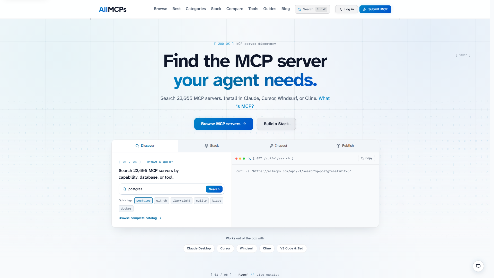

<div align="center">

<picture>
  <source media="(prefers-color-scheme: dark)" srcset="brand-assets/logo-full-light.svg">
  <source media="(prefers-color-scheme: light)" srcset="brand-assets/logo-full-dark.svg">
  
</picture>

### The open directory for Model Context Protocol servers

Discover, evaluate, and install MCP servers — _give your AI agents superpowers._

[**allmcps.com**](https://allmcps.com) · [Browse](https://allmcps.com/browse) · [Tools](https://allmcps.com/tools) · [Guides](https://allmcps.com/guides) · [Blog](https://allmcps.com/blog)

[](https://github.com/Jackalope-Dev/all-mcps/actions/workflows/ci.yml)
[](LICENSE)
[](https://nextjs.org)
[](https://workers.cloudflare.com)



</div>

## What this is

[Model Context Protocol](https://modelcontextprotocol.io) servers let AI agents
talk to real systems — databases, browsers, filesystems, APIs. There are
thousands of them, scattered across GitHub repos with inconsistent READMEs and
no common way to search or compare them.

AllMCPs is the directory that fixes that. It catalogs **22,000+ MCP servers**
with semantic search, category browsing, health checks, and a copy-paste install
config for every listing.

- **Search and browse** across 50+ categories, with per-listing detail pages
  covering install steps, tools exposed, and upstream health.
- **Free browser tools** — config generator and validator, protocol inspector,
  token calculator, OpenAPI-to-MCP converter, and a playground.
- **Agent-native** — every listing has a copy-paste agent prompt, and the site
  exposes `llms.txt`, an MCP server of its own, and DNS-based agent discovery.
- **Claim and verify** — maintainers prove ownership of a repo or domain and
  edit their own listings.

> [!NOTE]
> **Adding a server doesn't need a pull request.** Listings live in a database —
> submit at [allmcps.com/submit](https://allmcps.com/submit), and claim an
> existing listing from its page to edit it.

## Quick start

Requires **Node 22** (see `.nvmrc`).

```bash
npm install
npm run dev
```

Open [localhost:3000](http://localhost:3000). No Cloudflare account, database,
or API key is needed to run the site locally.

In `next dev` there are no Cloudflare bindings, so data comes from
`data/mcp-servers.json` — a sample catalog of ~113 listings spanning every
category, enough to work on essentially any page. In production the same code
paths read from D1 and fall back to that file on error (see `lib/servers.ts`).

To work against the full catalog locally, rebuild it from the public source
lists — and don't commit the result:

```bash
node scripts/seed.mjs
```

## Tech stack

| Layer | Choice |
| --- | --- |
| Framework | Next.js (App Router) on [OpenNext](https://opennext.js.org/cloudflare) |
| Runtime | Cloudflare Workers |
| Database | Cloudflare D1 (SQLite) via [Drizzle ORM](https://orm.drizzle.team) |
| Search | Cloudflare Vectorize + Workers AI for semantic search |
| Storage | R2 for logos, screenshots, and the ISR cache |
| Auth | Auth.js magic links, with Turnstile on public forms |
| Tooling | Biome, Vitest, Lefthook |

## Project layout

```
app/           App Router routes — directory, listings, tools, guides, blog, API
components/    Shared React components and UI primitives
lib/           Data access and domain logic (lib/servers.ts is the entry point)
db/ drizzle/   Drizzle schema and numbered migrations
content/blog/  Markdown blog posts (YYYY-MM-DD-slug.md)
mcp-server/    The AllMCPs MCP server itself
scripts/       Build, enrichment, ingest, and maintenance scripts
```

## Scripts

| Command | What it does |
| --- | --- |
| `npm run dev` | Start the dev server |
| `npm run build` | Production build |
| `npm run verify` | Typecheck + lint + tests — the gate before any PR |
| `npm run check` | Biome format and lint, writing fixes |
| `npm test` | Vitest suite |
| `npm run preview` | Build with OpenNext and preview the Workers bundle |
| `npm run deploy` | Build and deploy to Cloudflare Workers |
| `npm run db:generate` | Generate a Drizzle migration from `db/schema.ts` |
| `npm run db:migrate:local` | Apply migrations to the local D1 |

## Contributing

Contributions are welcome — see [CONTRIBUTING.md](./CONTRIBUTING.md) for setup,
the checks a change has to pass, and the conventions that aren't obvious from
the code.

Two worth knowing up front:

- **This is not the Next.js you may know.** The project tracks a newer release
  with breaking changes. Read the bundled guides in `node_modules/next/dist/docs/`
  before writing routing or rendering code. See [AGENTS.md](./AGENTS.md).
- **UI work follows [BRAND_GUIDE.md](./BRAND_GUIDE.md)** — colors, typography,
  and logo usage.

Please read the [Code of Conduct](./CODE_OF_CONDUCT.md) before participating,
and report security issues privately per [SECURITY.md](./SECURITY.md).

## License

Source code is [MIT licensed](./LICENSE).

The catalog data in `data/mcp-servers.json` describes third-party projects and
remains the property of their authors. The AllMCPs name, logo, and
`brand-assets/` are trademarks of Jackalope Digital and aren't covered by the
MIT grant — see [LICENSE](./LICENSE).

<div align="center">

Built by [Jackalope Digital](https://jackalope.digital)

</div>
